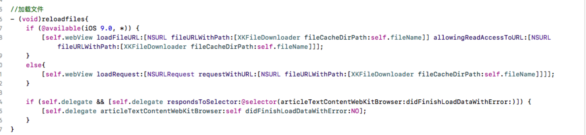
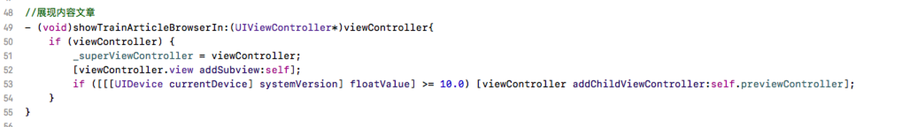
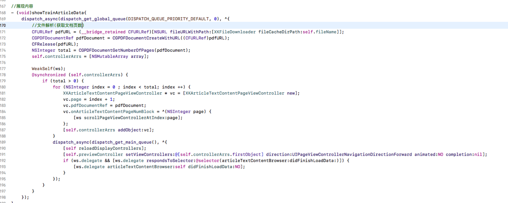
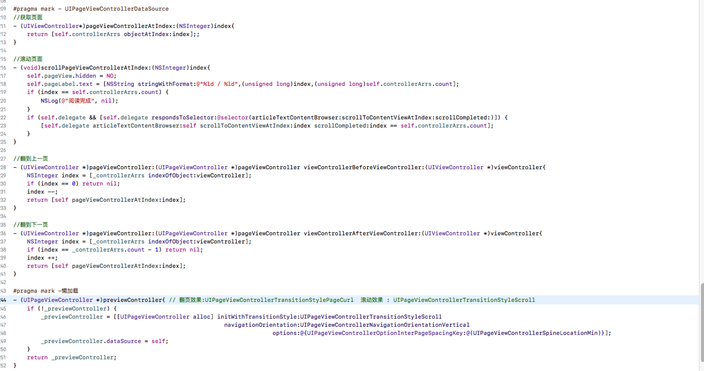

# XKArticleTextContentBrowser
基于图文课程PDF文档阅读的展示(包含3种方式)


* WKWebView加载 (iOS8.0之后)
* QuickLook框架 - QLPreviewController加载 
* CoreGraphics框架绘制


#### 一、WKWebView加载

```
iOS8.0之后,苹果已推出框架WebKit, WKWebView作为其中的浏览器控件,其加载速度,
内存占用率都优于UIWebView,故此本文, 着重介绍WKWebView(UIWebView用法接近)

```

其用法简单如下:




#### 二、QLPreviewController加载

```
QLPreviewController是系统自带的文件预览控制器,要使用QLPreviewController
先得在文件中导入头文件#import <QuickLook/QuickLook.h>，并且实现其代理方法QLPreviewControllerDataSource

```


1. QLPreviewController只能加载本地文件，不支持在线预览。显示效果比webView要好。
2. QLPreviewController会自带导航和工具栏, 如果要加载到视图中去, 需要将QLPreviewController中视图添加到父视图,且在iOS10.0之后,需要加入到子控制器中




#### 三、CoreGraphics框架绘制

CGContexDrawPDFPage和UIPageViewController实现翻页浏览功能





绘制内容:


UIPageViewController, 在UIPageViewControllerTransitionStyleScroll模式下, 如果使用展现时创建的方式,展示视图,会出现页面在第二页或者倒数第二页重复的原因, 故本项目, 使用全局数据源存储, 可同时兼容两种方式的使用.

#### 四、完整项目

```
 项目中,详细展现了几种方式的使用, 并且封装了下载XKFileDownloader框架, 结合使用

```

Github地址: [XKArticleTextContentBrowser](https://github.com/ryanmans/XKArticleTextContentBrowser)


